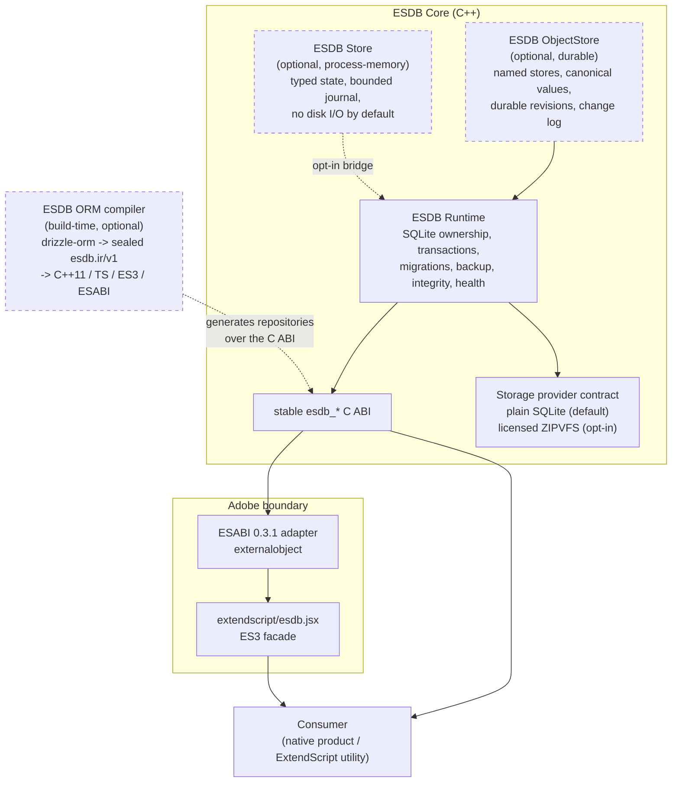

# ESDB: Native application state and durable storage for Adobe tooling

### SQLite-backed Runtime + two optional Store layers + ESABI ExternalObject adapter

---

## Part Of The Same Toolkit

> Production-grade infrastructure for Adobe ExtendScript.

<table>
<tr>
<td width="50%" valign="top">

### Runtime Primitives

**[ESON](https://github.com/thelabcorner/eson)**  
Strict RFC 8259 JSON for ExtendScript.

**[ESB64](https://github.com/thelabcorner/es-b64)**  
Base64 and UTF-8 utilities.

**[ESARR](https://github.com/thelabcorner/es-arr)**  
ES5+ Array compatibility methods.

**[ESSTR](https://github.com/thelabcorner/es-str)**  
String whitespace and trim methods.

**[ESCHARS](https://github.com/thelabcorner/es-chars)**  
Native bulk byte operations.

**[ESHTTP](https://github.com/thelabcorner/es-http)**  
HTTP transport for ExtendScript automation.

**[ESTIMER](https://github.com/thelabcorner/es-timer)**  
Microsecond timing for ExtendScript automation.

**[ESRAND](https://github.com/thelabcorner/es-rand)**  
Deterministic random streams and sampling for ExtendScript.

</td>
<td width="50%" valign="top">

### Build & Integration Tools

**[ESPACK](https://github.com/thelabcorner/espack)**  
Self-extracting ExternalObject bundles.

**[ESMIN](https://github.com/thelabcorner/es-min)**  
Minification for shipped JSX bundles.

**[ESABI](https://github.com/thelabcorner/esabi)**  
Modern ExternalObject ABI declarations for native integrations.

**[VectorIPC](https://github.com/thelabcorner/vector-ipc)**  
Bounded local IPC for scripting hosts and native plug-ins.

**[ESTC](https://github.com/thelabcorner/estc)**  
TypeScript-to-ExtendScript build, compatibility, and live-parse tooling.

**[ESDB](https://github.com/thelabcorner/esdb)**  
Native state and durable storage for Adobe tooling.

**ESOBF** coming soon  
Obfuscation for hardened JSX distribution.

</td>
</tr>
</table>

Also from the same team: **[ArcFit.dev](https://arcfit.dev)**, deterministic arc warp for Illustrator.

---

## Why ESDB?

Adobe-native tools repeatedly need the same infrastructure: durable state, transactions, schema migration, integrity checks, backups, native/ExtendScript interoperability, and a safe path toward reactive application state.

ESDB centralizes that infrastructure without turning every consumer into a key/value database.

The project has deliberately separate layers:

- **ESDB Runtime** owns SQLite lifecycle, durability policy, transactions, migrations, health, backup, and the storage-backend contract.
- **ESDB ObjectStore** is an optional durable layer. It adds named on-disk stores, canonical values, monotonic revisions, and pull-based change polling, all layered above Runtime.
- **ESDB Store** is an optional process-memory state plane. It is deliberately not a SQLite database: named, typed, synchronous, and revisioned state that lives for the process lifetime and performs no disk I/O by default.
- **ESDB ORM compiler** is an optional build-time toolchain over Runtime. It is not a runtime engine and not a Store dependency.

A native product such as Workmark can use Runtime with its own relational schema. ExtendScript utilities can use ObjectStore for durable state and Store for fast in-process state. All share the same native engine.

ESDB is **not** "SQLite exposed to ExtendScript." SQLite is the durable kernel; ESDB defines the lifecycle, portability, typed values, revision model, and Adobe-facing boundary around it.

## Status

0.2.0 builds on the 0.1.0 foundation. It currently includes:

- pinned, vendored SQLite 3.53.4 with configure-time SHA-256 pin verification;
- stable opaque-handle C ABI and a move-only C++11+ RAII facade;
- explicit open, journal, synchronous, cache, busy-timeout, WAL-checkpoint, and foreign-key policies with readback verification;
- transactions and LIFO savepoints;
- product-owned schema migrations using PRAGMA user_version;
- integrity checks, online backup, and a controlled native-handle escape hatch;
- backend capability and database health snapshots;
- optional durable ObjectStore with canonical values, durable monotonic revisions, and change polling;
- optional process-memory Store with bounded journals, scan limits, and retained-floor/gap status;
- optional ORM compiler lane: `drizzle-orm@0.45.3` extraction into sealed `esdb.ir/v1`, deterministic C++11/TypeScript/ES3/ESABI generation, and `drizzle-kit@0.31.11` migration packaging;
- ESABI 0.3.1 ExternalObject adapter with transaction, typed ObjectStore, and bounded typed raw-SQL transport;
- ES3-safe facade with get/set/patch, transactions, subscriptions, exact INT64/BYTES wrappers, byte-exact UTF-8 transport, and a guarded unload lifecycle;
- native, adapter, store, and ORM drift/smoke/hardening tests;
- live Illustrator 30.6.0 / ExtendScript 4.5.6 facade validation.

Transparent page compression is **implemented as an opt-in ZIPVFS provider**, but it is not enabled in the public build. See [Compression](#compression).

## Architecture

Runtime has no hidden writer thread. Store may grow explicit buffered/cache policies later, but Runtime will remain neutral about scheduling.

For the complete design, see [docs/ARCHITECTURE.md](docs/ARCHITECTURE.md).

## Native API

Public headers live under include/esdb/.

~~~c
#include <esdb/esdb.h>

esdb_error error = {0};
esdb_open_options options;
esdb_database *db = NULL;

esdb_open_options_init(&options);
options.journal_mode = ESDB_JOURNAL_WAL;
options.synchronous = ESDB_SYNCHRONOUS_FULL;

if (esdb_open("state.sqlite", &options, &db, &error) != ESDB_OK) {
    /* inspect error.status / phase / SQLite codes / message */
}

esdb_exec(db,
    "CREATE TABLE IF NOT EXISTS settings("
    " key TEXT PRIMARY KEY,"
    " value TEXT NOT NULL"
    ");",
    &error);

esdb_close(db);
~~~

Runtime intentionally supports consumer-owned SQL schemas. esdb_native_handle() is a controlled escape hatch for native consumers that need APIs ESDB does not wrap; its lifetime and threading rules are documented in [docs/ABI.md](docs/ABI.md).

### C++ RAII

~~~cpp
#include <esdb/esdb.hpp>

esdb::Database db;
esdb::Error error;
esdb_open_options options{};

esdb_open_options_init(&options);
options.journal_mode = ESDB_JOURNAL_WAL;

if (esdb::Database::open("state.sqlite", &options, db, &error) != ESDB_OK) {
    // inspect error
}
~~~

The facade is move-only and status-returning; it does not translate ESDB failures into C++ exceptions.

## ORM compiler (optional)

ESDB also includes an optional compiler-oriented relational layer. It is a
build-time toolchain over Runtime, not a second runtime engine and not a Store
dependency.

The v1 authority chain is:

~~~text
Drizzle schema.ts + named queries
        -> sealed esdb.ir/v1
        -> generated C++11 / TypeScript / ES3 / ESABI contracts

drizzle-kit@0.31.11 migration SQL
        -> deterministic ESDB migration package
        -> esdb_migrate() / PRAGMA user_version
~~~

`drizzle-orm@0.45.3` is the pinned schema frontend and the stable
`drizzle-kit@0.31.11` CLI is the sole production DDL/diff author. Generated
repositories use persistent prepared statements and bound values only. The generated
ORM ES3 lane exposes named ESABI operations and does not transport SQL text. ESDB
also implements a separate bounded typed raw-SQL application-query escape hatch
for advanced callers; SQL text and typed bound values remain separate and caller
values are never interpolated. It is not part of the generated ORM v1 surface or
the production migration authority.

The checked-in User slice under `examples/orm/user/` is executable: CI
re-extracts the Drizzle schema, verifies deterministic generated artifacts,
builds/runs the native repository smoke, and builds/runs the concrete ESABI
bridge smoke. See [docs/ORM_ARCHITECTURE.md](docs/ORM_ARCHITECTURE.md) and
[tools/esdb-schema/README.md](tools/esdb-schema/README.md).

## Store layers

ESDB ships two independent optional layers, and they are not interchangeable.

### ObjectStore: durable, SQLite-backed

`esdb_object_store.h` is the IndexedDB-shaped durable layer above Runtime. The canonical value domain is NULL, BOOL, INT32, INT64, DOUBLE, UTF8, BYTES, ARRAY, OBJECT.

~~~c
#include <esdb/esdb.h>
#include <esdb/esdb_object_store.h>

esdb_value *value = NULL;
uint64_t revision = 0;

esdb_value_create_text(ESDB_VALUE_UTF8, "dark", 4, &value, NULL);
esdb_object_store_put(db, "settings", "theme", value, &revision, NULL);
esdb_value_destroy(value);
~~~

Revisions are monotonic durable metadata. Deleting or pruning change rows does not reset the current revision, and reopening the database preserves it. Store names and keys are data, never SQL identifiers. The `__esdb_` schema prefix is reserved.

### Store: process-memory

`esdb_store.h` is a different thing entirely. A Store is deliberately not a SQLite database. It is named, typed, synchronous, and revisioned state shared by every client that resolves the same ESDB core module in one process, and it performs no disk I/O by default. State disappears when the host process exits or the named store is destroyed.

Native plug-ins and the ExternalObject adapter share the same Store only when both link or load the same shared ESDB core library. Static copies intentionally have independent registries. Persistence is opt-in through a Runtime / ObjectStore bridge.

INT64 and BYTES remain native lossless types on both layers. They are never silently coerced into unsafe ExtendScript numbers or strings.

See [docs/STORE.md](docs/STORE.md).

## ExtendScript

The JSX facade exposes Store ergonomics while keeping the native adapter typed and SQL-free.

~~~jsx
#include "esdb.jsx"

ESDB.load("lib:ESDB");

var db = ESDB.open(new File("~/my-plugin-state.esdb"));
var settings = db.objectStore("settings").ensure();   // durable ObjectStore

settings.set("theme", "dark");
settings.patch({
    zoom: 1.25,
    grid: true
});

var theme = settings.get("theme");
var revision = settings.revision(); // exact decimal string

var sub = settings.subscribe("theme", function (change) {
    $.writeln("theme changed at " + change.revision);
});
settings.set("theme", "light");
sub.poll();

db.close();
ESDB.unload();
~~~

INT64 and BYTES stay explicit and lossless:

~~~jsx
settings.set("counter", ESDB.int64("9007199254740993"));
settings.set("blob", ESDB.bytes("00FF1080"));
~~~

ARRAY/OBJECT values use a strict peer codec. ESON is auto-detected when already loaded, or another `{parse,stringify}` codec can be supplied with `ESDB.useStructuredCodec()`. ESON is not bundled into ESDB, preserving ESDB's MIT distribution boundary.

Paths, Store names/keys, UTF-8 values, structured payloads, and BYTES use an ASCII-hex transport around the measured Adobe ExternalObject string-channel limitations. Live validation includes an astral-Unicode database path, astral Store names/keys, embedded U+0000 in values, exact INT64, BYTES, structured ESON objects, transactions, patch, change polling, key-filtered subscriptions, pruning, stale-handle rejection, and guarded unload on Illustrator 30.6.0 / ExtendScript 4.5.6.

`ESDB.unload()` refuses to unload while adapter database handles remain open. The ExternalObject adapter has no asynchronous JSX callbacks. Advanced callers may use `Database.query(sql, parameters, options)` / `run(sql, parameters)`; SQL text and typed parameters cross as separate arguments and values are bound natively, never interpolated.

## Build

### Vendored/verified SQLite

SQLite 3.53.4 is vendored in `third_party/sqlite`, so a fresh checkout is buildable without a system SQLite or a network fetch. Every CMake configure verifies the vendored `sqlite3.c`, `sqlite3.h`, and `sqlite3ext.h` against the canonical SHA-256 file hashes in `cmake/sqlite-pin.json`.

The same pin records SQLite's upstream amalgamation URL and SHA3-256 archive digest. To verify the vendored tree or repair it from upstream on any platform:

~~~text
cmake -P tools/fetch-sqlite.cmake
~~~

Force a verified re-download with `-DESDB_SQLITE_FORCE=ON`. `tools/fetch-sqlite.ps1` is a Windows convenience wrapper over the same CMake script, not a second dependency definition.

### Visual Studio preset

~~~powershell
cmake --preset vs2022-x64
cmake --build --preset vs2022-x64-release
ctest --preset vs2022-x64-release
~~~

ESDB_BUILD_EXTERNALOBJECT=ON builds ESDB.dll on Windows and resolves ESABI 0.3.1 from an exact installed package, ESDB_ESABI_SOURCE_DIR, the sibling ../esabi checkout, or finally immutable commit `400fefa14c1c09c0e51555f8e834975bdddbdb1d`. The Windows Release DLL uses MSVC reproducibility flags and is byte-identical across the two clean-build directories in the current validation ledger. Release ZIP packaging additionally requires Python 3: CPack uses a fixed `SOURCE_DATE_EPOCH` and post-build timestamp normalization without recompressing payloads, and CI verifies that two package generations are byte-identical.

## Validation

Current automated coverage includes C/C++ smoke, strict open-option validation and configuration readback, transactions, rollback, savepoints, migration rollback, canonical Store values, semantic Store corruption detection, revision metadata/sequence consistency, revision continuity after full prune and reopen, signed-64 revision bounds, read-only Store access, concurrent Store writer serialization, simultaneous same-connection Store readers/writers, coherent change-window snapshots, subscription reentrancy/BUSY handling, abrupt-process WAL recovery, two-process concurrent WAL writers, C++ callback containment, integrity/backup, backend capabilities, generation-tagged ExternalObject handles, and thread-local adapter staging. The ORM lane additionally gates sealed-IR drift, Drizzle extraction, deterministic model/migration generation, strict U1 parsing, C++11 generated bindings, migration linting/provenance, real native CRUD/migration execution, and the concrete named-operation ESABI bridge.

Illustrator 30.6.0 / ExtendScript 4.5.6 additionally passes the live ESTC parser gate and an end-to-end facade/DLL lifecycle smoke. ESDB now has first smoke-level abrupt-process recovery and two-process WAL-writer evidence; a broader fault-injection matrix and longer multi-process qualification remain future backend/release evidence. The exact evidence and qualification boundaries are preserved in [docs/RELEASE-VALIDATION.md](docs/RELEASE-VALIDATION.md).

## Compression

Plain SQLite is the reference backend and remains directly inspectable with stock SQLite tools.

ESDB defines a storage-provider contract (`ESDB_STORAGE_PLAIN`, `ESDB_STORAGE_COMPRESSED`, `ESDB_PROVIDER_SQLITE`, `ESDB_PROVIDER_ZIPVFS`) and implements a ZIPVFS-backed provider in `src/esdb_zipvfs.cpp` with Zstd and deflate codecs. ZIPVFS is proprietary SQLite source, so it is never vendored into public ESDB. A licensee points the build at their private `zipvfs.c` and `zipvfs.h`:

~~~powershell
cmake --preset vs2022-x64-release `
  -DESDB_ZIPVFS_SOURCE=C:/path/to/zipvfs.c `
  -DESDB_ZIPVFS_INCLUDE_DIR=C:/path/to/zipvfs/include `
  -DESDB_ZSTD_INCLUDE_DIR=C:/path/to/zstd/include `
  -DESDB_ZSTD_LIBRARY=C:/path/to/zstd.lib
~~~

The public build advertises plain SQLite only. A compressed request without a configured provider is rejected rather than silently falling back. Compression is not selected by familiarity or ratio alone: a candidate backend must pass the same semantics plus crash recovery, multi-process locking, backup, migration, and tooling gates before performance or size is considered.

See [docs/COMPRESSION.md](docs/COMPRESSION.md).

## Repository layout

~~~text
esdb/
├─ include/esdb/          public C/C++ API (esdb.h, esdb.hpp,
│                         esdb_object_store.h, esdb_store.h, esdb_value.h)
├─ src/                   Runtime, ObjectStore, memory Store, values, ZIPVFS
├─ adapters/externalobject/   ESABI adapter
├─ extendscript/          ES3 facade
├─ orm/                   ORM compiler contract and drizzle frontend
├─ examples/orm/user/     executable reference slice
├─ bench/                 ORM benchmark harness
├─ tests/                 native smoke/hardening + ORM test suite
├─ tools/                 esdb-schema CLI, SQLite pin/acquisition, live probes
├─ cmake/                 SQLite pin, ZIPVFS combine, CPack policy
└─ docs/
~~~

## Known limitations

- The only storage backend present in the public build is plain SQLite. ZIPVFS support requires a separately licensed source drop.
- No compressed backend has passed the correctness and performance gates in [docs/COMPRESSION.md](docs/COMPRESSION.md), so none is selectable by default.
- The JSX facade exposes durable ObjectStore and process-memory Store APIs plus synchronous pull-based change polling; asynchronous callbacks are not supported.
- Durable ObjectStore pruning is explicit and does not synthesize a gap event; the process-memory Store instead bounds its journal and exposes retained-floor/gap status.
- The process-memory Store is not durable and is not shared across processes; only clients that resolve the same shared ESDB core in one process share its registry.
- A database must outlive its transaction/savepoint/subscription handles.
- FULLMUTEX protects individual SQLite connection calls, and ESDB serializes Store mutations plus invariant-sensitive Store reads, but multi-call application transaction sequences still require application-level serialization.
- Live Illustrator runtime behavior is currently qualified on Illustrator 30.6.0 / ExtendScript 4.5.6 only; other host versions still require their own compatibility evidence.

## License

MIT. See [LICENSE](LICENSE).
