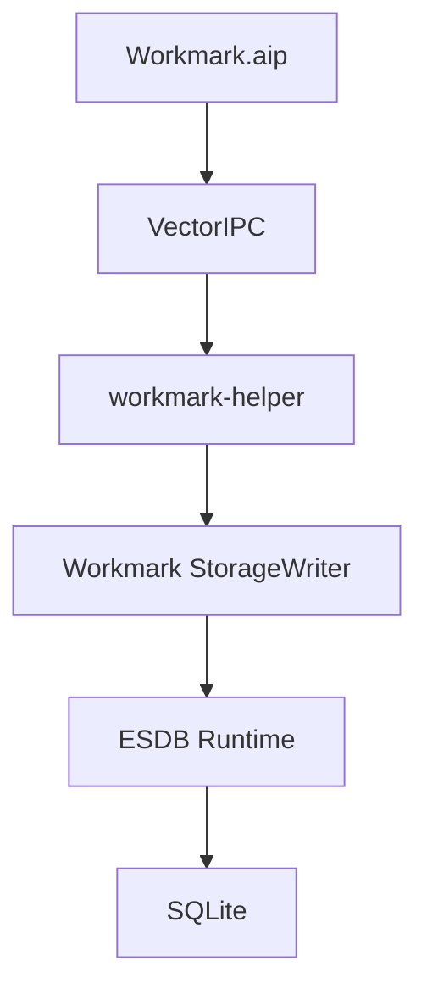

# ESDB architecture

## Principle

ESDB is a reusable Adobe-native Runtime and optional application-state toolkit whose durable kernel is
SQLite. Runtime is independent from both state APIs: a product may use its own relational schema directly.

## ESDB Runtime

Runtime is the stable substrate:

- owns one SQLite connection per esdb_database;
- defines open/configuration policy;
- exposes transactions and savepoints;
- provides schema-version/migration helpers without owning consumer schema;
- provides integrity, backup, health, and backend capabilities;
- exposes a controlled native SQLite handle;
- has no hidden writer thread and no background callbacks.

A consumer can use Runtime and never create an ESDB Store table.

### Product-owned schemas

Runtime exists specifically so applications can keep relational models relational. Workmark should keep its version graph, intervals, metadata, and indexes in its own tables inside workmark-helper.

ESDB must not move SQLite into Illustrator's in-process .aip, replace VectorIPC, or turn Workmark records into generic Store blobs.

## State APIs

ESDB exposes two distinct optional state APIs; they share the typed-value domain but not persistence or
revision semantics:

| API | Entry point | Storage/lifetime | Change history |
|---|---|---|---|
| **ObjectStore** | `db.objectStore(name)` / `esdb_object_store.h` | SQLite-backed and durable | Persistent global revisions; application-controlled pruning; no synthesized gap event in v0.1 |
| **Store** | `ESDB.store(name)` / `esdb_store.h` | Process-memory registry shared by clients using the same shared ESDB core; discarded at process exit or explicit destroy | Per-named-store revisions; bounded 4,096-change journal; `retainedFloor()` and `ESDB_ERR_GAP` for expired cursors |

ObjectStore-owned SQLite objects use the reserved `__esdb_` prefix. Consumers must not create or mutate
tables under that prefix. The process-memory Store creates no SQLite objects and performs no database I/O.
Neither state API replaces product-owned relational SQL.

## Canonical values

The native domain is NULL, BOOL, INT32, INT64, DOUBLE, UTF8, BYTES, ARRAY, OBJECT.

ARRAY and OBJECT are tagged structured-text payloads in v0.1. The tag is part of ESDB's cross-runtime domain; consumers may choose ESON/JSON validation policy above it.

The database format is not an ExtendScript object representation.

### ExtendScript transport

The ESABI adapter exposes durable ObjectStore and process-memory Store operations directly while keeping the Adobe ABI transport separate from the native value representation. Because the measured ExternalObject string lane cannot faithfully carry embedded U+0000 or every surrogate/astral sequence, the high-level JSX facade converts byte-exact strings to ASCII hex over the boundary and reconstructs UTF-8 on the native side. INT64/revision/count values use canonical decimal strings rather than JavaScript Number.

ARRAY/OBJECT values remain UTF-8 structured payloads. The JSX facade can use ESON or another explicit `{parse,stringify}` peer codec; ESDB does not bundle ESON or make its parser part of the storage format.

Database transactions exposed to JSX are canonical native ESDB transactions owned by the adapter slot.
`ObjectStore.patch()` is applied transactionally through that database; process-memory `Store.patch()` is
atomic under its Store lock and does not open a SQLite transaction.

## Revisions and reactivity

Each committed ObjectStore mutation receives a durable monotonically increasing revision stored separately
from surviving change rows. Process-memory Store revisions are monotonic for that named Store while it is
alive, but are not persisted across process exit.

For ObjectStore, the current revision is persisted separately from surviving change rows. Therefore:

- pruning all change rows does not reset revision;
- reopening does not reset revision;
- a later mutation receives a greater revision.

Change delivery is pull-based. Native consumers and JSX callers poll changes since a known revision. ESDB
does not call arbitrary ExtendScript from a native thread.

For ObjectStore, `limit == 0` means `ESDB_OBJECT_CHANGE_LIMIT_MAX`. The in-memory Store uses its own
`ESDB_STORE_CHANGE_LIMIT_MAX` limit.

ObjectStore pruning is explicit. v0.1 does not synthesize a gap event when a caller asks for history
already pruned; applications needing that guarantee must coordinate pruning with acknowledged cursors. The
memory Store instead bounds history automatically and reports `ESDB_ERR_GAP` below its retained floor.

## Concurrency

SQLite is compiled serialized (SQLITE_THREADSAFE=1).

ESDB_OPEN_FULLMUTEX is the default and permits SQLite calls on a connection from multiple threads. It does not make a begin -> operations -> commit sequence into an isolated application-level critical section. Shared-connection transaction sequences still require application serialization.

ESDB_OPEN_NOMUTEX requires external serialization of all use of that connection.

ObjectStore serializes complete durable mutations per connection and serializes invariant-sensitive reads
against those writers. Standalone mutations begin with `BEGIN IMMEDIATE`, so SQLite's configured busy
handler arbitrates the writer slot before mutation work begins; inside an existing transaction ESDB uses an
internal savepoint. Change queries snapshot their bounded result set under the connection Store mutex and
invoke callbacks only after releasing it. The process-memory Store has a separate per-store mutex for
mutations, reads, and snapshots. Neither mechanism replaces application-level transaction ownership for
multi-call Runtime sequences.

No operation may race esdb_close. Database handles must outlive transaction/savepoint/subscription handles.

For cross-process access, behavior is SQLite's behavior for the selected journal/VFS. The plain backend advertises WAL and multi-process support. Future compressed backends must advertise capabilities independently.

## Durability policy

ESDB rejects explicit `journal_mode=MEMORY`, `journal_mode=OFF`, and `synchronous=OFF` requests. Unknown enum values and nonzero reserved option fields are rejected before opening. When a journal/synchronous/cache/WAL-autocheckpoint policy is explicitly requested, ESDB reads the corresponding pragma back and requires SQLite to have applied that exact setting; a backend/path that cannot honor it fails configuration instead of silently degrading it. WAL autocheckpoint uses an explicit three-state contract: `ESDB_WAL_AUTOCHECKPOINT_UNCHANGED` inherits SQLite's connection default, `0` disables automatic checkpoints, and a positive value sets the page threshold. `UNCHANGED` remains available for journal/synchronous callers intentionally inheriting the existing database/backend mode.

Native callers may intentionally bypass policy through the SQLite escape hatch, but health reporting reflects the observed configuration.

ObjectStore v0.1 mutations are transactional and durable at the surrounding SQLite commit boundary. When
no outer transaction exists, a successful mutation commits; when an outer transaction exists, returned
state/revisions remain provisional until the caller commits it. Process-memory Store mutations are
synchronous and in-memory; they are not covered by SQLite durability or database transactions.

ObjectStore currently provides one SQLite-backed transactional persistence behavior; buffered/cache
persistence tiers are not implemented. Process-memory Store is a separate API, not a persistence mode on
ObjectStore.

## Backend contract

esdb_backend_capabilities makes storage assumptions explicit:

- backend ID/version;
- WAL support;
- multi-process support;
- stock-tool compatibility;
- backup/savepoint/URI support;
- compression capability and codec metadata.

v0.1 reports plain SQLite, no compression, and stock-tool compatibility. The exact SQLite 3.53.4 amalgamation is vendored in the source tree and its three source/header files are SHA-256 verified by CMake at configure time against the canonical release pin.

## Error model

All native fallible calls return esdb_status. Where accepted, esdb_error adds ESDB status, phase, SQLite primary/extended codes, and bounded diagnostic text.

C++ allocation/callback boundaries used by the C API are contained inside ESDB. Expected errors are statuses, not exceptions.

## Crash/recovery direction

The first correctness oracle is ordinary SQLite.

A compressed backend is not qualified until it passes:

1. clean round-trip parity;
2. transaction atomicity;
3. abrupt process termination during write;
4. WAL/checkpoint/recovery behavior where advertised;
5. concurrent readers/writers and multiple processes where advertised;
6. backup/restore;
7. migration;
8. corruption detection;
9. stock-tool/export behavior;
10. only then throughput and compression ratio.
