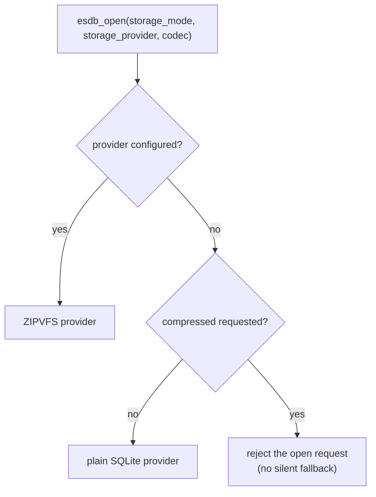

# Compression

Compression is an opt-in storage provider. It is not a prerequisite for ESDB semantics and it is not
enabled in the public build.

## What is implemented today

ESDB defines a storage-provider contract and implements a ZIPVFS-backed provider behind it.

| Surface | Location | Status |
|---|---|---|
| `esdb_storage_mode` (`DEFAULT`, `PLAIN`, `COMPRESSED`) | `include/esdb/esdb.h` | shipped |
| `esdb_storage_provider` (`AUTO`, `SQLITE`, `ZIPVFS`) | `include/esdb/esdb.h` | shipped |
| `esdb_codec` (`NONE`, `ZSTD`, `DEFLATE`) plus `compression_level` | `include/esdb/esdb.h` | shipped |
| Capability advertisement (`compression_supported`, `page_codec`, `codec_id`, `codec_version`) | `esdb_backend_capabilities` | shipped |
| ZIPVFS provider implementation (Zstd and deflate codecs, codec registry) | `src/esdb_zipvfs.cpp` | shipped, compiled only when configured |
| Amalgamation combine step | `cmake/CombineZipvfs.cmake` | shipped |
| Public build provider | `ESDB_PROVIDER_SQLITE` only | by design |

ZIPVFS is proprietary SQLite source. It is never vendored into public ESDB. A licensee points the
build at a private checkout:

~~~powershell
cmake --preset vs2022-x64-release `
  -DESDB_ZIPVFS_SOURCE=C:/path/to/zipvfs.c `
  -DESDB_ZIPVFS_INCLUDE_DIR=C:/path/to/zipvfs/include `
  -DESDB_ZSTD_INCLUDE_DIR=C:/path/to/zstd/include `
  -DESDB_ZSTD_LIBRARY=C:/path/to/zstd.lib
~~~

`ESDB_ZIPVFS_SOURCE` requires `ESDB_ZIPVFS_INCLUDE_DIR` to contain `zipvfs.h`. Zstd requires both the
include directory and the library, or neither. The combine step appends the licensed source to the SQLite
amalgamation in a single translation unit; only the generated build-tree file contains it.

A compressed request against a build without a configured provider is rejected rather than silently
falling back to plain SQLite.

## Reference

The semantic oracle is ESDB over ordinary SQLite 3.53.4.

Plain SQLite currently advertises:

- WAL: supported;
- multi-process use: supported;
- stock SQLite tooling: supported;
- online backup: supported;
- compression: unsupported.

Any compressed backend must advertise its own capability matrix rather than inherit these flags.

## Correctness gates

A backend cannot enter performance comparison until it passes:

1. identical logical SQL/Store behavior against plain SQLite;
2. transaction commit/rollback/savepoint parity;
3. integrity checking;
4. migration rollback;
5. backup/restore;
6. abrupt writer termination and recovery;
7. WAL/checkpoint behavior if WAL is advertised;
8. multi-process readers/writers if multi-process is advertised;
9. corruption/fault-injection cases;
10. deterministic codec/version metadata and upgrade policy.

A backend that cannot preserve a capability must report it as unsupported.

## Compatibility gate

Compression may make the physical database unreadable by stock sqlite3.

If so, ESDB must provide an explicit export/inspection path before products that require stock-tool observability can select that backend.

Workmark should initially remain on plain SQLite unless measured data shows its metadata/index database contains enough compressible material to justify a compressed backend. Its large content-addressed payloads are a separate storage concern.

## Performance experiment

Only after correctness:

- representative page sizes;
- cache-size sweep;
- WAL and checkpoint configuration;
- cold and warm reads;
- write transaction throughput;
- database size;
- backup and export cost;
- process startup and open latency;
- CPU time and peak memory.

The decision criterion is a Pareto comparison against plain SQLite, not compression ratio alone.

## Open research direction

The preferred direction is transparent page and storage compression below logical SQL and schema semantics.
Zstd is the first codec candidate because the goal is to reduce local database footprint without converting
application schemas into compressed blobs. The implemented ZIPVFS provider carries both Zstd and deflate
codecs behind one registry.

ChunkDB row/chunk experiments remain research evidence. They are not the ESDB base format.

## Selection state

No compressed backend has entered performance comparison, because none has yet cleared the correctness gates
in this document. Plain SQLite remains the reference backend and the only provider in the public build; the
ZIPVFS provider is implemented but not qualified.

No backend is considered selected until the repository contains reproducible crash and concurrency evidence
for it.
