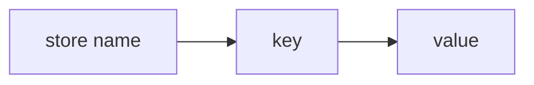
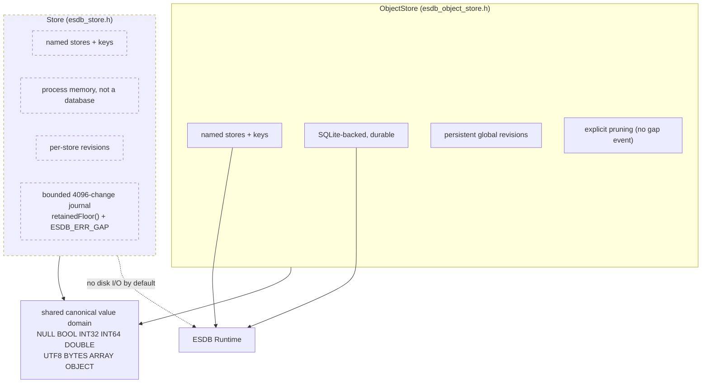

# ESDB Store and ObjectStore

ESDB provides two separate state/object APIs above the Runtime boundary:

- **ObjectStore** (`db.objectStore(name)`) is SQLite-backed durable state, with
  persistent revisions and a change journal.
- **Store** (`ESDB.store(name)`) is process-memory state, shared by handles
  resolving the same ESDB shared core in one process. It is discarded at
  process exit; `Store.destroy()` removes a named store during the process.

Both APIs use typed values and synchronous operations. Their storage lifetime,
change retention, and transaction behavior differ. Product-owned relational
schemas use ESDB Runtime directly; neither state API is the ORM.

## Scope

Use ObjectStore for named objects that must survive process exit; use the process-memory Store for ephemeral
application state. Either may support settings or caches depending on the required lifetime and revision
contract.

It is not a replacement for product-owned relational schema. Applications with joins, constrained graphs, interval models, or domain-specific indexing should use Runtime directly.

## ObjectStore namespaces

ObjectStore names and keys are UTF-8 data, never interpolated SQL identifiers.

All ObjectStore-owned SQL objects use the reserved `__esdb_` prefix.

## Two store layers

The two layers share the typed-value domain but not persistence or revision semantics.

## Process-memory Store

The C API is declared in `esdb_store.h`; the ES3 facade creates one with
`ESDB.store(name)`. Its values and revision/change state live in process memory,
not the database. Independent handles to the same ESDB shared core and name
resolve the same state; a statically linked ESDB copy has an independent
registry. Closing the last Store handle does not persist its contents, and the
process exit discards them. Calling `destroy()` on a Store instance explicitly
removes that named state.

The Store serializes mutations and applies `patch()` atomically. It has a
bounded 4,096-entry change journal; `retainedFloor()` reports its oldest
retained revision, and a request older than that floor returns `ESDB_ERR_GAP`.
This differs from ObjectStore's durable change log, where pruning is explicit
and old-history gap synthesis is not provided in v0.1.

## Shared value domain

The canonical values are:

- ESDB_VALUE_NULL
- ESDB_VALUE_BOOL
- ESDB_VALUE_INT32
- ESDB_VALUE_INT64
- ESDB_VALUE_DOUBLE
- ESDB_VALUE_UTF8
- ESDB_VALUE_BYTES
- ESDB_VALUE_ARRAY
- ESDB_VALUE_OBJECT

Numeric scalar payloads use a canonical little-endian binary representation inside ESDB values before storage. ObjectStore reads validate the canonical payload shape again: BOOL must be exactly one byte `0`/`1`, INT32 exactly four bytes, INT64/DOUBLE exactly eight bytes, NULL empty, and structured text valid UTF-8. Semantic payload violations are reported as `ESDB_ERR_CORRUPT` rather than being silently decoded.

UTF-8, arrays, and objects are length-delimited byte payloads. v0.1 validates UTF-8 validity but deliberately does not prescribe a JSON parser.

## ObjectStore mutation atomicity

An ObjectStore put/delete operation writes its change journal record, record mutation, and durable revision metadata as one SQLite transaction scope. When the connection is in autocommit mode, ESDB starts `BEGIN IMMEDIATE` before the mutation; this acquires the SQLite writer slot through the configured busy handler before any ObjectStore state is read or changed, avoiding deferred read-to-write upgrade races under WAL/multi-process writers. When a caller already owns a transaction, ESDB uses an internal savepoint instead and participates in that outer transaction.

Rolling back the outer transaction also rolls back the Store mutation and its revision allocation. A revision returned by put/delete inside that transaction is therefore provisional until the outer commit; a rolled-back revision may later be reused by SQLite.

## Durable revisions

A durable ObjectStore revision identifies committed change order.

The authoritative current revision is stored in `__esdb_meta`, not inferred from the maximum surviving change row. ESDB also cross-checks that metadata against SQLite's `sqlite_sequence` entry for `__esdb_object_changes`; malformed, non-canonical, or inconsistent revision metadata is treated as corruption.

This is necessary because the change log can be pruned.

Invariant:

~~~text
revision(after prune all) == revision(before prune)
revision(after reopen)     == previous revision
next mutation revision     > previous revision
~~~

Regression tests enforce all three.

## ObjectStore change queries

esdb_object_store_changes_since() returns rows with revision > after_revision in ascending order.

limit behavior:

- 1..ESDB_OBJECT_CHANGE_LIMIT_MAX: explicit bound;
- 0: use ESDB_OBJECT_CHANGE_LIMIT_MAX;
- values greater than the maximum: invalid argument.

Callbacks receive borrowed store_name and key pointers valid only for the duration of the callback.

A non-zero callback return stops iteration normally.

A C++ exception thrown by a callback is contained and converted to ESDB_ERR_INTERNAL.

## ObjectStore subscriptions

A subscription is a pull cursor over the same change journal.

Polling:

1. reads changes after the cursor revision;
2. invokes the caller synchronously;
3. advances the cursor to the last delivered revision on success.

No native worker thread invokes host code. The cursor revision is atomically published. Only one poll may be active per subscription: concurrent or callback-reentrant polls on that same subscription return `ESDB_ERR_BUSY` instead of blocking behind the active callback.

ObjectStore operations that depend on the multi-statement record/change/revision invariant serialize against ObjectStore writers on the same ESDB connection. A complete put/delete/prune mutation cannot interleave with another ObjectStore mutation, and reads such as get/count/revision cannot observe a mutation half-applied. Standalone ObjectStore mutations acquire SQLite write ownership with `BEGIN IMMEDIATE`, so the configured busy timeout applies at a deterministic acquisition point; inside a caller-owned transaction they use a reserved internal savepoint. First-use ObjectStore schema initialization follows the same rule and rechecks the schema after acquiring write ownership, preventing concurrent processes from racing independent schema creators. Change polling first copies a coherent bounded snapshot while serialized, then releases the connection's ObjectStore mutex before invoking callbacks. This does not turn an application-level begin -> many calls -> commit sequence into a cross-thread critical section; callers still serialize logical transaction ownership.

Subscriptions borrow their parent database; destroy them before closing the database.

## Read-only connections

ObjectStore reads work through `ESDB_OPEN_READONLY` when the ObjectStore schema already exists. Schema discovery on a read-only connection is verification-only: ESDB never attempts `CREATE TABLE` as a side effect of a read.

`esdb_object_store_ensure()` succeeds for an already-registered ObjectStore but cannot create a missing one. `put`, mutation-producing `delete`, and change-log pruning require a writable database and fail deterministically on a read-only connection. A read-only database with no ESDB ObjectStore schema reports `ESDB_ERR_NOT_FOUND` rather than trying to initialize one.

## ObjectStore pruning

`esdb_object_store_prune_changes()` removes ObjectStore journal rows through a revision without altering ObjectStore data or the durable global revision.

v0.1 intentionally leaves pruning policy to the application.

For durable ObjectStore history, applications that need guaranteed detection of a cursor falling behind pruned rows must coordinate pruning with acknowledged consumer revisions; v0.1 does not synthesize a gap event. The separate process-memory Store has a bounded journal, exposes `retainedFloor()`, and returns `ESDB_ERR_GAP` for requests older than its retained floor.

## ExtendScript facade

`extendscript/esdb.jsx` exposes the same Store semantics as an ES3-friendly synchronous API:

~~~jsx
ESDB.load("lib:ESDB");

var db = ESDB.open(new File("~/my-plugin/state.esdb"));
var settings = db.objectStore("settings").ensure();

settings.set("theme", "dark");
settings.patch({
    zoom: 1.25,
    grid: true
});

var theme = settings.get("theme");
var revision = settings.revision(); // exact decimal string

db.close();
ESDB.unload();
~~~

`patch()` is not a sequence of independent durable writes: it opens an ESDB transaction, executes all own properties, and commits once. An exception during the callback path rolls the transaction back.

### Exact values in ES3

ExtendScript cannot safely represent every signed 64-bit integer as a Number. The facade therefore makes exactness explicit:

~~~jsx
settings.set("counter", ESDB.int64("9007199254740993"));
String(settings.get("counter")); // "9007199254740993"

settings.set("blob", ESDB.bytes("00FF1080"));
settings.get("blob").toHex();     // "00FF1080"
~~~

ObjectStore and process-memory Store revisions/counts, prune counts, and INT64 values cross ExternalObject as canonical decimal strings. `ESDB.toSafeNumber()` is available only when the caller deliberately wants to assert that an exact unsigned value fits JavaScript's safe-integer range.

Paths, Store names/keys, UTF-8 values, structured text, and bytes use an ASCII-hex transport around the measured ExternalObject string-channel limitations. This permits embedded U+0000 and astral Unicode to round-trip through the high-level facade even though the raw Adobe string ABI cannot safely carry them.

### ARRAY/OBJECT codec

ESDB itself validates ARRAY/OBJECT payloads as UTF-8 but does not impose a parser. The JSX facade follows the same rule.

For JavaScript object ergonomics, provide a strict codec:

~~~jsx
// If ESON is already loaded, this is optional: ESDB auto-detects it.
ESDB.useStructuredCodec(ESON);

settings.set("layout", {
    columns: 3,
    labels: ["A", "B"]
});

var layout = settings.get("layout");
~~~

ESON is an optional peer integration and is **not bundled** into ESDB. This keeps ESDB's MIT distribution independent of ESON's GPL license while allowing projects that already use ESON to opt into strict structured values.

### Pull subscriptions

The JSX subscription layer is intentionally host-driven:

~~~jsx
var sub = settings.subscribe("theme", function (change) {
    $.writeln("theme changed at revision " + change.revision);
});

settings.set("theme", "light");
sub.poll();
~~~

No native thread invokes JavaScript. `poll()` queries the durable change journal synchronously and advances the subscription cursor through both matching and non-matching rows, so key filters do not replay skipped history indefinitely.

## Future persistence policies

The intended vocabulary is:

- memory: no SQLite persistence;
- buffered: bounded/coalesced persistence with an explicit crash-loss window;
- durable: mutation completion implies committed persistence;
- cache: reconstructible persistence that can be evicted.

ObjectStore currently has one SQLite-backed transactional durability behavior. The process-memory Store is a separate implemented API, not a selectable persistence tier. Buffered and cache persistence policies are not implemented.
